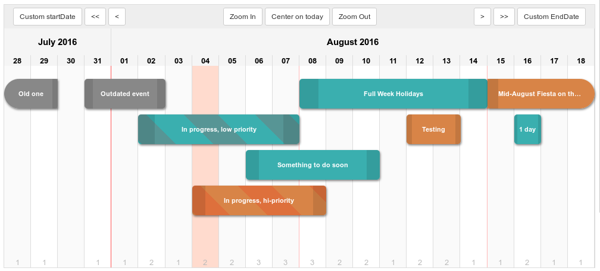

# Plantt

### AngularJS module : Simple daily scheduler on a timeline

Check the **live demo** (kept updated) here : [code.polosson.com/Plantt/](http://www.code.polosson.com/Plantt/)

Preview:

## Features

This angular widget takes a **list** of "events" (i.e. items defined in time by a start date and an end date) to display them on a daily timeline. You can drag & drop them to redefine their dates.

### Interface
 - **Daily grid** (one column = one day) with numbers (day in month) and month-year labels in header
 - **Automatic vertical positioning** to avoid collisions
 - Current day and current events **highlighted with CSS classes**
 - **Custom CSS allowed** for all aspects of the UI (see `plantt.css` for examples)
 - **Drag & drop** support (for desktop only at the moment) to visually move and resize events
 - Fully **independant of the controller**, allowing you to make anything you want with this widget !
 - **View manipulation**: zoom in & out, move left or right, set custom start and end dates with a bunch of scope-accessible functions
 - Emits **custom DOM events** to handle callbacks for every UI actions (`daySelect`, `periodSelect`, `eventMove`, `eventScale`, `eventOpen`, `planttError`)

### Available interactions

 - **Interface**
   - Click & drag the grid header to move the view left or right
 - **Add events**
   - Double-click on the grid to add an event on a single day
   - Click & drag on the grid to add an event on the corresponding period
 - **Change events**
   - Click & drag an event to move it on the timeline and set its dates
   - Click & drag event's handles to extend or shrink an event and set its dates
 - **Other event-related actions**
   - Double-click an event to (make something you want)

Note: for these interactions to be effective, they must be processed in callbacks defined in controller. See `js/example.js` for examples use-cases, but you can make anything you want in your own controller.

## Installation

Just import AngularJS, and the Plantt's javacript and CSS files:

    <link href="plantt.css" rel="stylesheet" type="text/css" />
    
    

Then, make sure the file **`plantt-template.html`** is readable into your project's root folder. You can use this file
to see how functions are called, then modify it to suits your needs.

## Usage

Insert an element **`scheduler`** into your HTML, and attach your controller to it:

    <scheduler ng-controller="planttExample"></scheduler>

Then, inject the module in your app:

	var yourApp = angular.module("yourApp", ["plantt.module"]);

Finally, define your own controller:

	yourApp.controller("planttExample", function($scope){

		// Basic settings (optional)
		$scope.eventHeight	= 50;	// Height of events elements in pixels
		$scope.eventMargin	= 10;	// Margin above events elements for spacing
		$scope.nbLines		= 6;	// Maximum number of lines we can draw in timeline

		// Create the events list
		$scope.events = [
		    {
			id: 0, title: 'Test', type: 'normal',
			startDate: new Date(2016, 8-1, 20),
			endDate: new Date(2016, 8-1, 25)
		    }
		]

		// Listen to the "eventMove" DOM event, to store the new dates of the event
		$scope.$on('eventMove', function(e, event, deltaDays){
			event.startDate = addDaysToDate(angular.copy(event.startDate), deltaDays);
			event.endDate	= addDaysToDate(angular.copy(event.endDate), deltaDays);
			$timeout(function(){
				$scope.renderView();
			}, 0);
		});

		// (...)

		// Listen to the "planttError" DOM event, to do something when an error occurs
		$scope.$on('planttError', function(e, err){
			console.log('Plantt '+err.levelName+' ('+err.level+'):', err.message);
		});
	}

**To be noticed**:
  - Your controller must have a **`$scope.events`** variable, which must be an Array object. The following data is needed in the objects of events collection:
    - **id** (int, must be unique)
    - **title** (string, as you wish)
    - **type** (string, corresponding to one or more CSS classes)
    - **startDate** (date object)
    - **endDate** (date object)
  - You must use the **`$timeout`** function to call the **`$scope.renderView()`** function in order to refresh the view after a change of any event in the list.

### That's it!

Be sure to read (the documentation)[http://www.code.polosson.com/Plantt/#doc] for full details on scope variables, methods and custom DOM events.

Have fun ! :)
