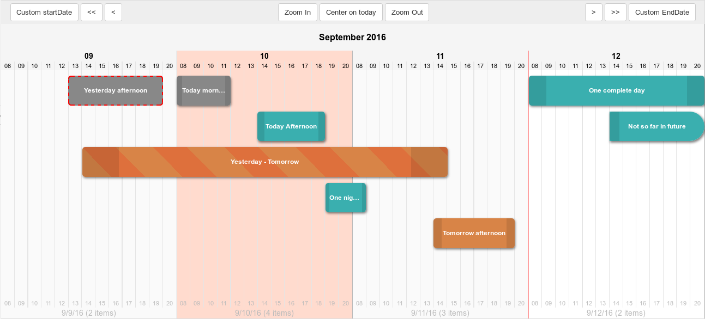

# Plantt

### AngularJS module : Simple daily scheduler on a timeline

Check the **live demo** (kept updated) here : [code.polosson.com/Plantt/](http://www.code.polosson.com/Plantt/)

Preview, daily mode:

Preview, hourly mode:

## Features

This angular widget takes a **list** of "events" (i.e. items defined in time by a start date and an end date) to display them on a daily (or hourly) timeline.
Among many other features, you can drag & drop them to redefine their dates.

### Interface
 - **Daily grid** (one column = one day) with numbers (day in month) and month-year labels in header
 - **Hourly grid** (same as daily but with sub-columns, one per hour) with numbers (hour in day)
 - **Automatic vertical positioning** to avoid collisions
 - Current day and current events **highlighted with CSS classes**
 - **Custom CSS allowed** for all aspects of the UI: grid, events... (see `plantt.css` for examples)
 - **Drag & drop** support (for desktop only at the moment) to visually move and resize events in timeline
 - Fully **independant of the controller**, allowing you to make anything you want with this widget !
 - **View manipulation**: zoom in & out, move left or right, set custom start and end dates with a bunch of scope-accessible functions
 - Emits **custom DOM events** to handle callbacks for every UI actions (`daySelect`, `periodSelect`, `eventMove`, `eventScale`, `eventOpen`, `planttError`), allowing you to make your own checks before storing new dates of the event, and save it on your server using ajax for example
 - **Automatic lock** of current and past events (with possible secure days margin)
 - Dates **Internationalization** really simple with [ng-locale](https://github.com/angular/angular.js/tree/master/src/ngLocale) (i18n)

### Available interactions

 - **Interface**
   - Click & drag the grid header to move the view left or right
 - **Add events**
   - Double-click on the grid to add an event on a single day
   - Click & drag on the grid to add an event on the corresponding period
 - **Change events**
   - Click & drag an event to move it on the timeline and set its dates
   - Click & drag event's handles to extend or shrink an event and set its dates
 - **Other event-related actions**
   - Double-click an event to (make something you want)

Note: for the events interactions to be effective, they must be processed in callbacks defined in controller, using Plantt's custom DOM events.
See `js/example.js` for examples use-cases, but you can make anything you want in your own controller!

### Known limitations

 - Only one scheduler per web page. Else, strange behaviour will happen (duplicates when adding events for instance)
 - Events stacking (Y axis) is limited to a defined number of lines (but it's a scope setting that can be modified in controller)
 - In hourly mode, if event's start or end hour are outside the day's limits (before first hour of day or after end hour of day), they go beyond and are displayed on previous (or next) day.
 - In houlry mode again, when you grab an event which ends after the last displayed day, its end date will be truncated (same for start date if over the first displayed day).

## Installation

Just import AngularJS, and the Plantt's javacript and CSS files:

    <link href="plantt.css" rel="stylesheet" type="text/css" />
    
    

Then, make sure the file **`plantt-template.html`** is readable into your project's root folder. You can use this file
to see how functions are called, then modify it to suits your needs.

To internationalize (translate) the dates, you can add any of the ng-locale providers from AngularJs source code,
available [here](https://github.com/angular/angular.js/tree/master/src/ngLocale). For example, like in demo, add the
following line after the angular-1.5.8.min.js script src:

    

## Usage

Insert an element **`scheduler`** into your HTML, and attach your controller to it:

    <scheduler ng-controller="planttExample"></scheduler>

Then, inject the module in your app:

	var yourApp = angular.module("yourApp", ["plantt.module"]);

Finally, define your own controller:

	yourApp.controller("planttExample", function($scope){

		// Basic settings (optional)
		$scope.eventHeight		= 50;				// Height of events elements in pixels
		$scope.eventMargin		= 10;				// Margin above events elements for spacing in pixels
		$scope.nbLines			= 5;				// Maximum number of lines we can draw in timeline
		$scope.autoLock			= true;				// To enable the automatic lock of past events
		$scope.lockMarginDays	= 0;				// Number of days between today and the start date of events for the automatic lock to take effect
		$scope.formatDayLong	= 'EEEE MMMM dd';	// The JS date format for the long display of dates
		$scope.formatDayShort	= 'yyyy-MM-dd';		// The JS date format for the short display of dates
		$scope.formatMonth		= 'MMMM yyyy';		// The JS date format for the month display in header

		$scope.useHours			= true;				// To specify the use of hours (to display hourly grid and don't force events hours to 12:00)
		$scope.dayStartHour		= 8;				// The hour number at which the day begins (default 08:00)
		$scope.dayEndHour		= 20;				// The hour number at which the day ends   (default 20:00)

		// Create the events list
		$scope.events = [
		    {
			id: 0, title: 'Test', type: 'normal',
			startDate: new Date(2016, 8-1, 20),
			endDate: new Date(2016, 8-1, 25)
		    }
		]

		// Listen to the "eventMove" DOM event, to store the new dates of the event
		$scope.$on('eventMove', function(e, event, newStartDate, newEndDate, newStartHour, newEndHour){
			newStartDate.setHours(newStartHour);
			newEndDate.setHours(newEndHour);
			event.startDate = newStartDate;
			event.endDate   = newEndDate;
			$timeout(function(){
				$scope.renderView();
			}, 0);
		});

		// (...)

		// Listen to the "planttError" DOM event, to do something when an error occurs
		$scope.$on('planttError', function(e, err){
			console.log('Plantt '+err.levelName+' ('+err.level+'):', err.message);
		});
	}

**To be noticed**:
  - Your controller must have a **`$scope.events`** variable, which must be an Array object. The following data is needed in the objects of events collection:
    - **id** (int, must be unique)
    - **title** (string, as you wish)
    - **type** (string, corresponding to one or more CSS classes)
    - **startDate** (date object)
    - **endDate** (date object)
  - You must use the **`$timeout`** function to call the **`$scope.renderView()`** function in order to refresh the view after a change of any event in the list.

## Documentation

Be sure to read [the documentation](http://www.code.polosson.com/Plantt/#doc) for full details on scope variables, methods and custom DOM events.

## Licence

© Polosson 2016 - MIT Licence. You can use, copy, modify, merge, publish, distribute, sublicense,
and/or sell copies of the Software, at the condition you include this copyright notice and a copy
of the permission notice (see LICENCE file).

Have fun ! :)
